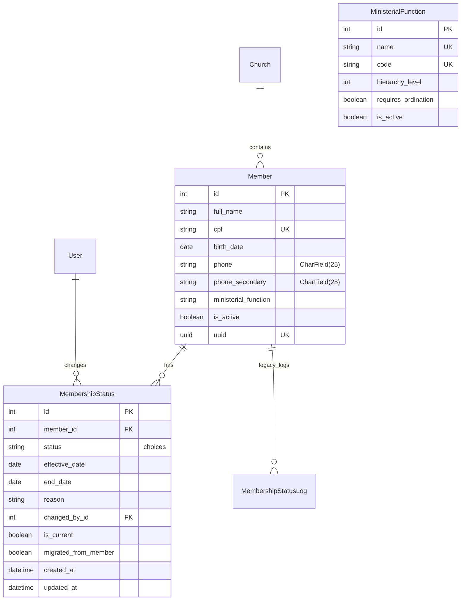

# TIMELINE DE IMPLEMENTAÇÃO - MIGRAÇÃO MEMBER ↔ MEMBERSHIPSTATUS

## VISÃO GERAL DA ARQUITETURA FINAL



## CRONOGRAMA DETALHADO (6 SEMANAS)

### SEMANA 1-2: PREPARAÇÃO E INFRAESTRUTURA
**Responsável:** Backend Architect + DBA  
**Risco:** Baixo

#### Dia 1-3: Setup Inicial
- [ ] **Criar branch `feature/membership-status-migration`**
- [ ] **Implementar novos modelos** (`models_new.py`)
  - MembershipStatus
  - MinisterialFunction
  - Validadores aprimorados
- [ ] **Criar migrações Django**
  - Nova tabela `members_membershipstatus`
  - Nova tabela `members_ministerialfunction`  
  - Índices otimizados
  - Constraints de integridade

#### Dia 4-7: Infraestrutura de Migração
- [ ] **Implementar sistema de fases** (`migrations_strategy.py`)
- [ ] **Criar health checker** para monitoramento
- [ ] **Setup de rollback automático**
- [ ] **Testes de performance** em ambiente staging
- [ ] **Documentação técnica** da estratégia

#### Dia 8-14: Novos Serializers e Views
- [ ] **Implementar serializers V2** (`serializers_new.py`)
  - MembershipStatusSerializer
  - MemberSerializerV2 com compatibilidade
  - Versionamento da API
- [ ] **Criar views aprimoradas** (`views_new.py`)
  - MembershipStatusViewSet
  - MemberViewSetV2
  - Endpoints de analytics

### SEMANA 3: DUAL WRITE E VALIDAÇÕES
**Responsável:** Backend Architect + Senior Developer  
**Risco:** Médio

#### Dia 15-17: Implementação Dual Write
- [ ] **Modificar Member.save()** para escrever em ambas tabelas
- [ ] **Implementar validações de negócio**
  - Transições de status permitidas
  - Regras de idade e função ministerial
  - Integridade de dados familiares
- [ ] **Testes automatizados** para dual write

#### Dia 18-21: Sistema de Validações
- [ ] **Aplicar padrões de choices** (`standards_and_validations.py`)
- [ ] **Implementar validadores telefone** (CharField aprimorado)
- [ ] **Sistema de permissões** por status
- [ ] **Testes de integração** completos

### SEMANA 4: MIGRAÇÃO DE DADOS
**Responsável:** DBA + Backend Architect  
**Risco:** Alto

#### Dia 22-24: Migração Gradual
- [ ] **Executar Fase 3** - Migração de dados históricos
- [ ] **Migração em lotes** (100 membros por vez)
- [ ] **Monitoramento contínuo** de integridade
- [ ] **Backup completo** antes da migração

#### Dia 25-28: Verificação e Ajustes
- [ ] **Health check diário** da migração
- [ ] **Correção de inconsistências** encontradas
- [ ] **Performance tuning** de queries
- [ ] **Preparação para dual read**

### SEMANA 5: DUAL READ E FRONTEND
**Responsável:** Full Stack Team  
**Risco:** Médio

#### Dia 29-31: Implementação Dual Read
- [ ] **Ativar Fase 4** - Leitura da nova tabela
- [ ] **Fallback automático** para tabela antiga
- [ ] **Monitoramento de queries** e performance
- [ ] **Ajustes de índices** se necessário

#### Dia 32-35: Atualização Frontend
- [ ] **Atualizar interfaces** para usar novos endpoints
  - Formulários de membro
  - Listagens e filtros
  - Dashboard de analytics
- [ ] **Implementar histórico de status** no frontend
- [ ] **Testes E2E** completos

### SEMANA 6: FINALIZAÇÃO E CLEANUP
**Responsável:** Backend Architect + QA  
**Risco:** Baixo

#### Dia 36-38: Testes Finais
- [ ] **Testes de carga** em staging
- [ ] **Validação de todos workflows** de status
- [ ] **Verificação de compatibilidade** API
- [ ] **Documentação de usuário** atualizada

#### Dia 39-42: Deploy e Cleanup
- [ ] **Deploy para produção** (com rollback preparado)
- [ ] **Monitoramento 24h** pós-deploy
- [ ] **Executar Fase 5** - Cleanup (se tudo estável)
- [ ] **Documentação final** e post-mortem

## PLANO DE ROLLBACK POR FASE

### Rollback Fase 1 (Preparação)
**Tempo:** < 5 minutos  
**Impacto:** Zero
```sql
DROP TABLE members_membershipstatus;
DROP TABLE members_ministerialfunction;
```

### Rollback Fase 2 (Dual Write)
**Tempo:** < 10 minutos  
**Impacto:** Zero
```python
# Desabilitar dual write no código
DUAL_WRITE_ENABLED = False
```

### Rollback Fase 3 (Migração)
**Tempo:** < 30 minutos  
**Impacto:** Perda de dados migrados apenas
```python
MembershipStatus.objects.filter(migrated_from_member=True).delete()
```

### Rollback Fase 4 (Dual Read)
**Tempo:** < 15 minutos  
**Impacto:** Volta para estrutura antiga
```python
# Reativar leitura do campo antigo
USE_LEGACY_STATUS_FIELD = True
```

### Rollback Fase 5 (Cleanup)
**Tempo:** 2-4 horas  
**Impacto:** Requer migração reversa
```sql
-- Restaurar campo membership_status
-- Restaurar dados do backup
```

## MÉTRICAS DE SUCESSO

### Performance
- [ ] **Queries de listagem:** < 200ms (atual: ~150ms)
- [ ] **Criação de membro:** < 100ms (atual: ~80ms)
- [ ] **Mudança de status:** < 50ms (novo)
- [ ] **Dashboard analytics:** < 500ms (atual: ~800ms)

### Funcionalidade
- [ ] **100% compatibilidade** com API atual
- [ ] **Zero downtime** durante migração
- [ ] **Histórico completo** de mudanças de status
- [ ] **Auditoria** de todas alterações

### Qualidade
- [ ] **Cobertura de testes:** > 90%
- [ ] **Zero regressões** em funcionalidades existentes
- [ ] **Documentação** completa da nova API
- [ ] **Treinamento** da equipe concluído

## RISCOS E MITIGAÇÕES

### Alto Risco: Migração de Dados (Semana 4)
**Mitigação:**
- Backup completo antes da migração
- Migração em lotes pequenos
- Health check contínuo
- Rollback automático se erro > 1%

### Médio Risco: Dual Write (Semana 3)
**Mitigação:**
- Testes extensivos em staging
- Monitoramento de performance
- Logs detalhados de inconsistências
- Rollback rápido disponível

### Baixo Risco: Frontend Updates (Semana 5)
**Mitigação:**
- Compatibilidade com API antiga
- Deploy incremental por página
- Feature flags para novas funcionalidades

## COMUNICAÇÃO E STAKEHOLDERS

### Weekly Standups
- **Segunda:** Status da semana anterior
- **Quarta:** Progresso e bloqueadores
- **Sexta:** Preparação próxima semana

### Stakeholders
- **Product Owner:** Aprovação de mudanças UX
- **Tech Lead:** Revisão arquitetural
- **QA Lead:** Estratégia de testes
- **DevOps:** Deploy e monitoring

### Go/No-Go Checkpoints
- **Final Semana 2:** Infraestrutura pronta
- **Final Semana 3:** Dual write estável
- **Final Semana 4:** Migração concluída
- **Final Semana 5:** Frontend atualizado

## RECURSOS NECESSÁRIOS

### Humanos
- **1 Backend Architect** (dedicado 100%)
- **1 Senior Developer** (dedicado 60%)
- **1 DBA** (dedicado 40%)
- **1 Frontend Developer** (dedicado 50% semana 5)
- **1 QA Engineer** (dedicado 30%)

### Infraestrutura
- **Ambiente staging** com dados de produção
- **Monitoring avançado** (DataDog/New Relic)
- **Backup storage** adicional
- **Database replicas** para testes