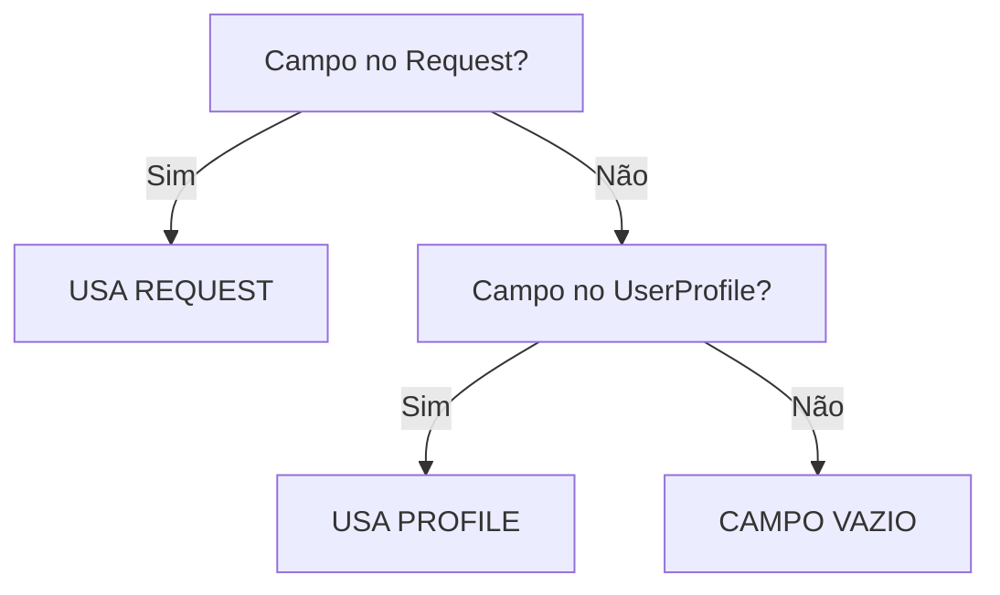

# 🔄 Church Admin → Member Conversion - Otimização de Campos

**Issue:** #28  
**Data:** 2025-01-20  
**Status:** ✅ Implementado e Otimizado

## 📋 Objetivo da Otimização

Evitar que o usuário Church Admin tenha que preencher **novamente** dados que já foram fornecidos durante o cadastro inicial na plataforma. Isso melhora significativamente a UX e reduz o atrito no processo de conversão.

---

## 🔍 Análise de Campos

### ✅ Campos Pré-preenchidos Automaticamente

| Campo Member | Origem | Status |
|--------------|--------|--------|
| `full_name` | `CustomUser.full_name` | ✅ Sempre preenchido |
| `email` | `CustomUser.email` | ✅ Sempre preenchido |
| `phone` | `CustomUser.phone` | ✅ Sempre preenchido |
| `birth_date` | `UserProfile.birth_date` | ⚠️ Se disponível no perfil |
| `gender` | `UserProfile.gender` | ⚠️ Se disponível no perfil |
| `cpf` | `UserProfile.cpf` | ⚠️ Se disponível no perfil |
| `address` | `UserProfile.address` | ⚠️ Se disponível no perfil |
| `zipcode` | `UserProfile.zipcode` | ⚠️ Se disponível no perfil |

### ❌ Campos Exclusivos do Member (Não existem em User)

| Campo | Tipo | Obrigatório | Motivo |
|-------|------|-------------|--------|
| `rg` | CharField | ❌ Opcional | Específico de membro eclesiástico |
| `marital_status` | CharField | ✅ Obrigatório | Dado eclesiástico relevante |
| `ministerial_function` | CharField | ✅ Obrigatório | Define função na igreja |
| `membership_status` | CharField | ✅ Auto-preenchido | Status de membresia |
| `membership_date` | DateField | ✅ Auto-preenchido | Data de entrada |
| `baptism_date` | DateField | ❌ Opcional | Dado sacramental |
| `conversion_date` | DateField | ❌ Opcional | Dado de testemunho |
| `notes` | TextField | ❌ Opcional | Observações gerais |

---

## 🚀 Mudanças Implementadas

### 1. Backend: `/backend/apps/members/views.py`

```python
# ANTES: Todos os campos vinham do request.data
member_data = {
    'cpf': request.data.get('cpf', ''),
    'birth_date': request.data.get('birth_date'),
    'gender': request.data.get('gender', ''),
    ...
}

# DEPOIS: Prioridade para dados do UserProfile
user_profile = getattr(request.user, 'profile', None)

member_data = {
    # Pré-preenche do perfil, permite override pelo request
    'cpf': request.data.get('cpf') or (user_profile.cpf if user_profile and user_profile.cpf else ''),
    'birth_date': request.data.get('birth_date') or (user_profile.birth_date if user_profile else None),
    'gender': request.data.get('gender') or (user_profile.gender if user_profile and user_profile.gender else ''),
    'address': request.data.get('address') or (user_profile.address if user_profile and user_profile.address else ''),
    'zipcode': request.data.get('zipcode') or (user_profile.zipcode if user_profile and user_profile.zipcode else ''),
    ...
}
```

**Lógica:**
- ✅ Se o usuário preencheu o campo no request → usa o request
- ✅ Se não preencheu mas existe no perfil → usa o perfil
- ✅ Se não existe em nenhum lugar → campo vazio

### 2. Frontend: Interface TypeScript Atualizada

`/frontend/src/services/auth.ts`

```typescript
export interface User {
  // ... outros campos
  profile?: {
    bio?: string;
    birth_date?: string;
    gender?: string;
    avatar?: string;
    cpf?: string;           // ✅ ADICIONADO
    address?: string;        // ✅ ADICIONADO
    zipcode?: string;        // ✅ ADICIONADO
    number?: string;         // ✅ ADICIONADO
    email_notifications?: boolean;
    sms_notifications?: boolean;
  };
}
```

### 3. Frontend: Modal com Pré-preenchimento

`/frontend/src/components/members/ConvertAdminToMemberModal.tsx`

```tsx
// useEffect que pré-preenche os campos do formulário
useEffect(() => {
  if (isOpen && user) {
    const fieldsPreFilled: string[] = [];
    
    if (user.profile) {
      if (user.profile.birth_date) {
        setValue('birth_date', user.profile.birth_date);
        fieldsPreFilled.push('Data de Nascimento');
      }
      
      if (user.profile.gender) {
        setValue('gender', user.profile.gender);
        fieldsPreFilled.push('Gênero');
      }
      
      if (user.profile.cpf) {
        setValue('cpf', user.profile.cpf);
        fieldsPreFilled.push('CPF');
      }
      
      if (user.profile.address) {
        setValue('address', user.profile.address);
        fieldsPreFilled.push('Endereço');
      }
      
      if (user.profile.zipcode) {
        setValue('zipcode', user.profile.zipcode);
        fieldsPreFilled.push('CEP');
      }
    }
    
    setProfileDataUsed(fieldsPreFilled);
  }
}, [isOpen, user, setValue]);
```

**Alerta Informativo no Modal:**

```tsx
{profileDataUsed.length > 0 && (
  <Alert className="bg-blue-50 border-blue-200">
    <Info className="h-4 w-4 text-blue-600" />
    <AlertDescription className="text-blue-800">
      <strong>Dados pré-preenchidos do seu perfil:</strong>{' '}
      {profileDataUsed.join(', ')}. Você pode alterar se necessário.
    </AlertDescription>
  </Alert>
)}
```

---

## 🎯 Benefícios da Otimização

### ✅ Experiência do Usuário
- ⚡ **Redução de tempo**: Usuário não precisa redigitar dados já fornecidos
- 🎨 **UX melhorada**: Feedback visual mostrando quais campos foram pré-preenchidos
- ✏️ **Flexibilidade**: Usuário pode alterar qualquer campo pré-preenchido se necessário

### ✅ Qualidade dos Dados
- 🔄 **Consistência**: Mesmos dados entre `UserProfile` e `Member`
- ❌ **Menos erros**: Evita inconsistências por redigitação
- ✅ **Integridade**: Validação única no backend (DRY principle)

### ✅ Manutenibilidade
- 📝 **Código limpo**: Lógica clara de fallback (request → profile → empty)
- 🧪 **Testabilidade**: Fácil testar cenários com/sem profile completo
- 📚 **Documentação**: Comentários explicam ordem de prioridade

---

## 🧪 Cenários de Teste

### Cenário 1: Perfil Completo
**Dado:** Church Admin com `is_profile_complete=True`, todos os campos preenchidos  
**Quando:** Abre modal de conversão  
**Então:** 
- ✅ Campos `birth_date`, `gender`, `cpf`, `address`, `zipcode` aparecem preenchidos
- ✅ Alerta azul mostra: "Dados pré-preenchidos: Data de Nascimento, Gênero, CPF, Endereço, CEP"
- ✅ Usuário só precisa preencher: `rg`, `marital_status`, datas de batismo/conversão (opcional)

### Cenário 2: Perfil Parcial
**Dado:** Church Admin preencheu apenas `birth_date` e `gender` no perfil  
**Quando:** Abre modal de conversão  
**Então:**
- ✅ Apenas `birth_date` e `gender` aparecem preenchidos
- ✅ Alerta azul mostra: "Dados pré-preenchidos: Data de Nascimento, Gênero"
- ✅ Campos `cpf`, `address`, `zipcode` aparecem vazios para preenchimento

### Cenário 3: Perfil Vazio
**Dado:** Church Admin nunca completou o perfil (`is_profile_complete=False`)  
**Quando:** Abre modal de conversão  
**Então:**
- ✅ Nenhum campo pré-preenchido
- ❌ Alerta azul não aparece
- ✅ Usuário preenche tudo do zero (experiência tradicional)

### Cenário 4: Override de Dados
**Dado:** Church Admin com CPF "111.111.111-11" no perfil  
**Quando:** No modal, altera manualmente para "222.222.222-22" e submete  
**Então:**
- ✅ Backend aceita o novo CPF "222.222.222-22"
- ✅ Member criado com CPF diferente do perfil (override manual respeitado)

---

## 📊 Ordem de Prioridade dos Dados



**Regra de Ouro:**
```
valor_final = request.data.get(campo) OR user.profile.campo OR '' (vazio)
```

---

## 🔧 Próximos Passos

### ✅ Completado
- [x] Análise de campos duplicados entre `User` e `Member`
- [x] Backend: pré-preenchimento automático via `user.profile`
- [x] Frontend: interface `User` atualizada com novos campos de perfil
- [x] Frontend: `useEffect` para pré-preencher formulário
- [x] Frontend: alerta informativo sobre campos pré-preenchidos

### 🔄 Pendente (Testes)
- [ ] Limpar cache do browser para testar submissão final
- [ ] Teste E2E completo: Login → Card → Modal → Submit → Sucesso
- [ ] Verificar comportamento com perfil parcialmente preenchido
- [ ] Testar override manual de campos pré-preenchidos

### 📝 Futuro (Opcional)
- [ ] Adicionar tooltip explicando origem dos dados pré-preenchidos
- [ ] Criar página de "Completar Perfil" antes da conversão
- [ ] Analytics: % de Church Admins que convertem vs tempo para completar form

---

## 📚 Arquivos Modificados

| Arquivo | Mudanças | LOC |
|---------|----------|-----|
| `/backend/apps/members/views.py` | Lógica de pré-preenchimento | ~20 linhas |
| `/frontend/src/services/auth.ts` | Interface `User.profile` expandida | +6 campos |
| `/frontend/src/components/members/ConvertAdminToMemberModal.tsx` | useEffect + alerta informativo | ~30 linhas |

**Total:** ~56 linhas de código adicionadas/modificadas

---

## 🎓 Lições Aprendidas

### 1. **Evitar Duplicação de Dados**
- ❌ **Ruim**: Pedir dados já fornecidos pelo usuário em outro momento
- ✅ **Bom**: Reaproveitar dados existentes quando possível

### 2. **Transparência com o Usuário**
- ❌ **Ruim**: Pré-preencher silenciosamente (usuário não sabe de onde veio)
- ✅ **Bom**: Mostrar alerta explicando quais campos foram pré-preenchidos

### 3. **Flexibilidade**
- ❌ **Ruim**: Bloquear campos pré-preenchidos (readonly)
- ✅ **Bom**: Permitir edição caso dados estejam desatualizados

### 4. **Ordem de Prioridade Clara**
- ❌ **Ruim**: Lógica confusa de fallback
- ✅ **Bom**: `request → profile → empty` (fácil de entender e testar)

---

## 📖 Referências

- **Issue Original:** #28 - "Criar funcionalidade para Church Admin virar membro"
- **Modelos Django:**
  - `backend/apps/accounts/models.py` - CustomUser + UserProfile
  - `backend/apps/members/models.py` - Member
- **Documentação:** 
  - `docs/MODULOS_SISTEMA_COMPLETO.md`
  - `docs/PERMISSOES_SEGURANCA_SISTEMA_COMPLETO.md`

---

**Última Atualização:** 2025-01-20  
**Autor:** Sistema de Conversão Church Admin → Member  
**Status:** ✅ Pronto para Teste E2E Final
