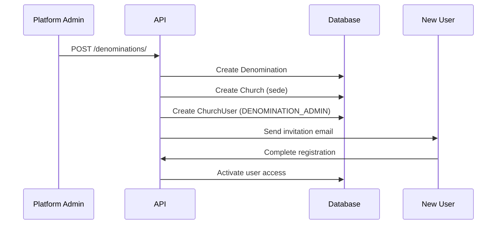
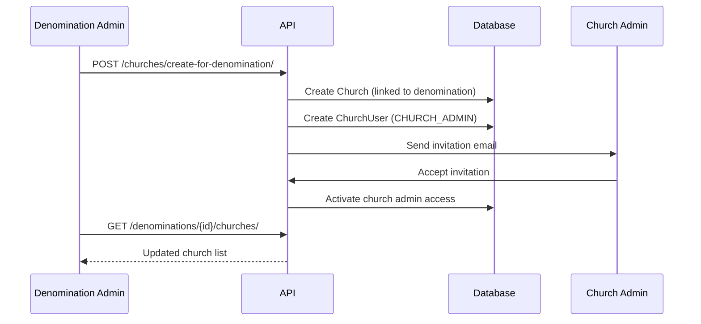
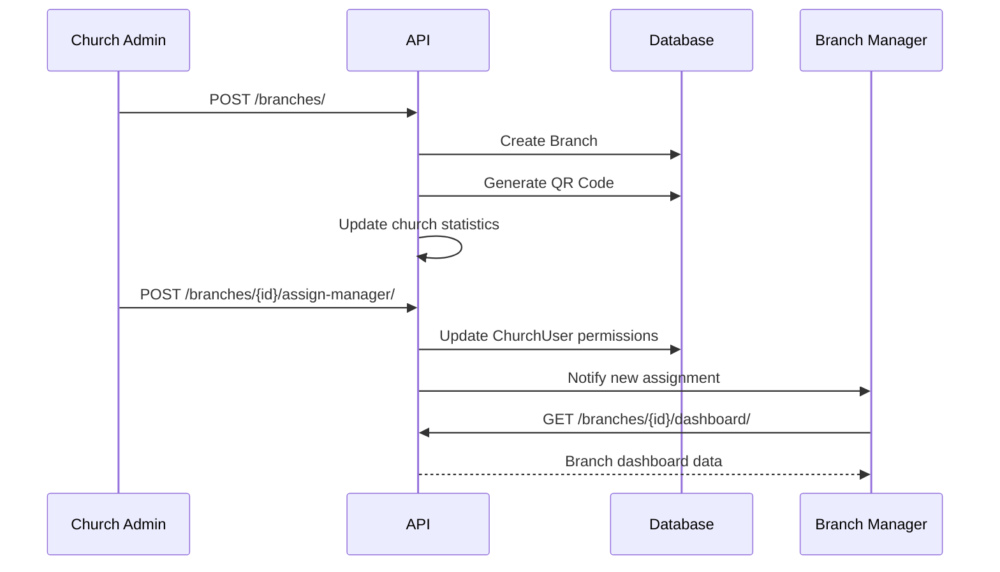
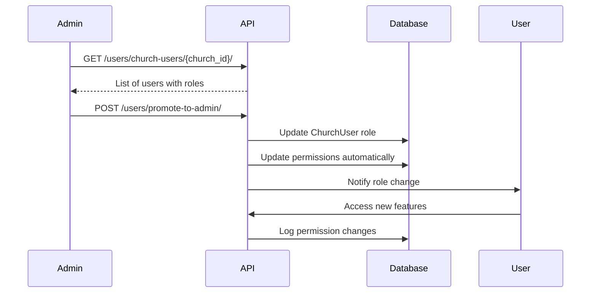

# Módulo de Gestão de Igrejas e Filiais - Plano Arquitetural Completo

## 📋 Visão Geral

O **Módulo de Gestão de Igrejas e Filiais** é uma extensão do sistema Obreiro Virtual que permite gestão hierárquica de organizações eclesiásticas, com três níveis administrativos: Denominação → Igreja → Filiais. Este módulo integra-se perfeitamente com a arquitetura multi-tenant existente e o sistema de permissões já implementado.

### 🎯 Objetivo

Permitir que usuários com diferentes níveis de acesso possam gerenciar suas respectivas organizações de forma hierárquica e controlada, mantendo o isolamento de dados (multi-tenancy) e aplicando permissões granulares baseadas no papel do usuário.

---

## 🔍 Análise da Estrutura Atual

### ✅ Pontos de Integração Identificados

#### **1. Sistema de Permissões Robusto**
- **ChurchUser**: Já implementado com papéis hierárquicos
- **RoleChoices**: SUPER_ADMIN, DENOMINATION_ADMIN, CHURCH_ADMIN, etc.
- **Permissões granulares**: can_manage_branches, can_manage_members, etc.
- **Classes de permissão**: IsDenominationAdmin, IsChurchAdmin, IsBranchManager

#### **2. Arquitetura Multi-Tenant**
- **TenantManager**: Filtragem automática por igreja
- **BaseModel**: UUID, soft-delete, timestamps
- **Middleware**: Contexto de igreja no request

#### **3. Modelos Existentes Compatíveis**
- **Denomination**: Estrutura guarda-chuva já implementada
- **Church**: Tenant principal com sistema de assinatura
- **Branch**: Filiais com QR codes e geolocalização
- **ChurchUser**: Vínculo usuário-igreja com papéis

#### **4. Sistema de Gestão Funcional**
- **Dashboard**: Estrutura de navegação implementada
- **API REST**: Endpoints com autenticação e autorização
- **Frontend React**: Componentes modulares e reutilizáveis

### 🔧 Melhorias Necessárias

1. **Endpoints específicos** para gestão hierárquica
2. **Views consolidadas** para administradores de denominação
3. **Serializers especializados** para cada nível administrativo
4. **Frontend especializado** para gestão de organizações

---

## 📊 Modelo de Dados Completo

### **Estrutura Hierárquica Existente**

```mermaid
erDiagram
    DENOMINATION {
        int id PK
        uuid uuid UK
        varchar name
        varchar short_name
        text description
        int administrator_id FK
        varchar email
        varchar phone
        varchar website
        text headquarters_address
        varchar headquarters_city
        varchar headquarters_state
        varchar headquarters_zipcode
        varchar cnpj UK
        image logo
        int total_churches
        int total_members
        bool is_active
        timestamp created_at
        timestamp updated_at
    }
    
    CHURCH {
        int id PK
        uuid uuid UK
        int denomination_id FK
        varchar name
        varchar short_name
        text description
        varchar email
        varchar phone
        varchar website
        text address
        varchar city
        varchar state
        varchar zipcode
        varchar cnpj UK
        int main_pastor_id FK
        image logo
        image cover_image
        varchar subscription_plan
        varchar subscription_status
        timestamp subscription_start_date
        timestamp subscription_end_date
        timestamp trial_end_date
        int max_members
        int max_branches
        int total_members
        int total_visitors
        bool is_active
        timestamp created_at
        timestamp updated_at
    }
    
    BRANCH {
        int id PK
        uuid uuid UK
        int church_id FK
        varchar name
        varchar short_name
        text description
        varchar email
        varchar phone
        text address
        varchar neighborhood
        varchar city
        varchar state
        varchar zipcode
        decimal latitude
        decimal longitude
        int pastor_id FK
        uuid qr_code_uuid UK
        image qr_code_image
        bool qr_code_active
        bool allows_visitor_registration
        bool requires_visitor_approval
        int total_visitors_registered
        int total_visitors
        int total_activities
        bool is_active
        timestamp created_at
        timestamp updated_at
    }
    
    CHURCH_USER {
        int user_id PK,FK
        int church_id PK,FK
        varchar role
        bool can_access_admin
        bool can_manage_members
        bool can_manage_visitors
        bool can_manage_activities
        bool can_view_reports
        bool can_manage_branches
        timestamp joined_at
        text notes
        bool is_active
        timestamp created_at
        timestamp updated_at
    }
    
    DENOMINATION ||--o{ CHURCH : "1..N"
    CHURCH ||--o{ BRANCH : "1..N"
    CHURCH ||--o{ CHURCH_USER : "1..N"
    BRANCH }o--o{ CHURCH_USER : "managed_branches"
```



### **Novos Campos e Relacionamentos Sugeridos**

#### **1. Melhorias no Modelo Denomination**
```python
# Campos adicionais sugeridos (já existem na maioria)
class Denomination(BaseModel):
    # ... campos existentes ...
    
    # Configurações organizacionais
    allows_independent_churches = models.BooleanField(
        "Permite Igrejas Independentes",
        default=True,
        help_text="Se permite igrejas não vinculadas à denominação"
    )
    
    # Limites organizacionais
    max_churches = models.PositiveIntegerField(
        "Limite de Igrejas",
        default=999999,
        help_text="Máximo de igrejas permitidas"
    )
    
    # Configurações de funcionalidades
    features_enabled = models.JSONField(
        "Funcionalidades Habilitadas",
        default=dict,
        help_text="Funcionalidades específicas da denominação"
    )
```

#### **2. Melhorias no Modelo Church**
```python
# Campos já implementados e funcionais
class Church(BaseModel):
    # Relacionamento hierárquico já existe
    denomination = models.ForeignKey('denominations.Denomination', ...)
    
    # Sistema de assinatura já implementado
    subscription_plan = models.CharField(...)
    subscription_status = models.CharField(...)
    
    # Limites já configurados
    max_members = models.PositiveIntegerField(...)
    max_branches = models.PositiveIntegerField(...)
```

#### **3. Melhorias no Modelo Branch**
```python
# Modelo já bem estruturado, sugestões de melhorias:
class Branch(BaseModel):
    # ... campos existentes ...
    
    # Configurações específicas de filial
    branch_type = models.CharField(
        "Tipo de Filial",
        max_length=20,
        choices=[
            ('main', 'Sede'),
            ('congregation', 'Congregação'),
            ('mission', 'Missão'),
            ('cell', 'Célula')
        ],
        default='congregation'
    )
    
    # Horários de funcionamento
    service_times = models.JSONField(
        "Horários de Culto",
        default=list,
        help_text="Horários de cultos e atividades"
    )
```

---

## 🔐 Estrutura de Permissões Específicas

### **Hierarquia de Papéis (Já Implementada)**

#### **1. SUPER_ADMIN (Platform Admin)**
- **Escopo**: Toda a plataforma SaaS
- **Acesso**: Irrestrito a todos os dados
- **Uso**: Administração técnica, suporte, configurações globais

#### **2. DENOMINATION_ADMIN**
- **Escopo**: Todas as igrejas da denominação
- **Permissões específicas**:
  - ✅ Criar e gerenciar igrejas
  - ✅ Definir administradores de igreja
  - ✅ Dashboard consolidado
  - ✅ Relatórios de toda a denominação
  - ✅ Configurações organizacionais

#### **3. CHURCH_ADMIN**
- **Escopo**: Igreja específica e suas filiais
- **Permissões específicas**:
  - ✅ Gerenciar membros e visitantes
  - ✅ Criar e administrar filiais
  - ✅ Definir responsáveis por filiais
  - ✅ Configurações da igreja

#### **4. BRANCH_MANAGER**
- **Escopo**: Filiais específicas designadas
- **Permissões específicas**:
  - ✅ Gerenciar membros da filial
  - ✅ Acompanhar visitantes
  - ✅ Organizar atividades locais
  - ✅ Relatórios da filial

### **Permissões Granulares (Já Implementadas)**

```python
class ChurchUser(BaseModel):
    # Permissões específicas já implementadas
    can_access_admin = models.BooleanField(default=False)
    can_manage_members = models.BooleanField(default=False)
    can_manage_visitors = models.BooleanField(default=False)
    can_manage_activities = models.BooleanField(default=False)
    can_view_reports = models.BooleanField(default=False)
    can_manage_branches = models.BooleanField(default=False)
    
    # Filiais específicas que pode gerenciar
    managed_branches = models.ManyToManyField('branches.Branch', ...)
```

### **Novas Permissões Sugeridas**

```python
# Adições sugeridas ao modelo ChurchUser
class ChurchUser(BaseModel):
    # ... campos existentes ...
    
    # Permissões de denominação
    can_manage_denomination = models.BooleanField(
        "Gerenciar Denominação",
        default=False,
        help_text="Se pode gerenciar configurações da denominação"
    )
    
    can_create_churches = models.BooleanField(
        "Criar Igrejas",
        default=False,
        help_text="Se pode criar novas igrejas na denominação"
    )
    
    can_manage_church_admins = models.BooleanField(
        "Gerenciar Admins de Igreja",
        default=False,
        help_text="Se pode definir administradores de igrejas"
    )
    
    can_view_financial_reports = models.BooleanField(
        "Ver Relatórios Financeiros",
        default=False,
        help_text="Se pode ver relatórios financeiros"
    )
```

---

## 🛠️ APIs REST Necessárias

### **1. Endpoints para Denominações**

#### **GET /api/v1/denominations/**
- **Permissão**: IsPlatformAdmin, IsDenominationAdmin
- **Função**: Listar denominações (filtrada por usuário)
- **Response**: Lista de denominações com estatísticas

#### **POST /api/v1/denominations/**
- **Permissão**: IsPlatformAdmin
- **Função**: Criar nova denominação
- **Payload**: Dados da denominação + administrador

#### **GET /api/v1/denominations/{id}/**
- **Permissão**: IsDenominationAdmin (própria denominação)
- **Função**: Detalhes da denominação
- **Response**: Dados completos + estatísticas

#### **PUT/PATCH /api/v1/denominations/{id}/**
- **Permissão**: IsDenominationAdmin (própria denominação)
- **Função**: Atualizar dados da denominação

#### **GET /api/v1/denominations/{id}/churches/**
- **Permissão**: IsDenominationAdmin
- **Função**: Listar igrejas da denominação
- **Response**: Lista com estatísticas de cada igreja

#### **GET /api/v1/denominations/{id}/dashboard/**
- **Permissão**: IsDenominationAdmin
- **Função**: Dashboard consolidado da denominação
- **Response**: Estatísticas, gráficos, métricas

### **2. Endpoints para Gestão Hierárquica de Igrejas**

#### **POST /api/v1/churches/create-for-denomination/**
- **Permissão**: IsDenominationAdmin
- **Função**: Criar igreja vinculada à denominação
- **Payload**: Dados da igreja + administrador inicial

#### **GET /api/v1/churches/my-managed-churches/**
- **Permissão**: IsDenominationAdmin, IsChurchAdmin
- **Função**: Listar igrejas que o usuário pode gerenciar
- **Response**: Lista filtrada por permissões

#### **POST /api/v1/churches/{id}/assign-admin/**
- **Permissão**: IsDenominationAdmin, IsChurchAdmin (se for pastor principal)
- **Função**: Designar administrador para igreja
- **Payload**: user_id, role

#### **GET /api/v1/churches/{id}/branches/**
- **Permissão**: IsChurchAdmin, IsBranchManager
- **Função**: Listar filiais da igreja
- **Response**: Lista filtrada por permissões do usuário

### **3. Endpoints para Gestão de Filiais**

#### **POST /api/v1/branches/**
- **Permissão**: IsChurchAdmin
- **Função**: Criar nova filial
- **Payload**: Dados da filial + responsável

#### **POST /api/v1/branches/{id}/assign-manager/**
- **Permissão**: IsChurchAdmin
- **Função**: Designar gestor para filial
- **Payload**: user_id, permissions

#### **GET /api/v1/branches/{id}/dashboard/**
- **Permissão**: IsBranchManager, IsChurchAdmin
- **Função**: Dashboard da filial
- **Response**: Estatísticas, visitantes, atividades

#### **POST /api/v1/branches/{id}/regenerate-qr/**
- **Permissão**: IsChurchAdmin, IsBranchManager
- **Função**: Regenerar QR code da filial
- **Response**: Novo QR code

### **4. Endpoints para Relatórios Consolidados**

#### **GET /api/v1/reports/denomination/{id}/consolidated/**
- **Permissão**: IsDenominationAdmin
- **Função**: Relatório consolidado da denominação
- **Parameters**: period, metrics
- **Response**: Dados agregados de todas as igrejas

#### **GET /api/v1/reports/church/{id}/branches-summary/**
- **Permissão**: IsChurchAdmin
- **Função**: Resumo de todas as filiais da igreja
- **Response**: Estatísticas comparativas das filiais

### **5. Endpoints para Administração de Usuários**

#### **GET /api/v1/users/church-users/{church_id}/**
- **Permissão**: IsChurchAdmin
- **Função**: Listar usuários da igreja
- **Response**: Lista com papéis e permissões

#### **POST /api/v1/users/promote-to-admin/**
- **Permissão**: IsDenominationAdmin, IsChurchAdmin
- **Função**: Promover usuário a administrador
- **Payload**: user_id, church_id, role

#### **POST /api/v1/users/assign-to-branch/**
- **Permissão**: IsChurchAdmin
- **Função**: Designar usuário para gerenciar filial
- **Payload**: user_id, branch_id, permissions

---

## 🔄 Fluxos de Negócio Principais

### **1. Fluxo de Criação de Denominação**



**Passos detalhados:**

1. **Platform Admin** cria denominação via painel administrativo
2. Sistema cria automaticamente uma **igreja-sede**
3. Define o **usuário administrador** da denominação
4. Envia **convite por email** para o administrador
5. Administrador completa o cadastro e assume controle
6. Dashboard da denominação fica disponível

### **2. Fluxo de Adição de Igreja à Denominação**



**Passos detalhados:**

1. **Denomination Admin** acessa painel de gestão
2. Cria nova igreja vinculada à denominação
3. Define **administrador da igreja** (usuário existente ou novo)
4. Sistema envia convite para o administrador da igreja
5. Administrador aceita e configura sua igreja
6. Igreja aparece no dashboard consolidado da denominação

### **3. Fluxo de Criação de Filial**



**Passos detalhados:**

1. **Church Admin** cria nova filial
2. Sistema gera **QR code único** automaticamente
3. Define **responsável pela filial** (opcional)
4. Configura permissões específicas do responsável
5. Filial fica disponível para gestão e visitantes
6. Dashboard da filial fica acessível

### **4. Fluxo de Gestão de Permissões**



**Passos detalhados:**

1. **Administrador** visualiza usuários da organização
2. Seleciona usuário para promover/alterar permissões
3. Define novo papel e permissões específicas
4. Sistema atualiza automaticamente as permissões
5. Usuário recebe notificação da mudança
6. Novas funcionalidades ficam disponíveis imediatamente

---

## 🎨 Interfaces de Usuário

### **1. Dashboard do Denomination Admin**

#### **Componentes Principais:**
- **KPI Cards**: Total de igrejas, membros, visitantes
- **Mapa de Igrejas**: Distribuição geográfica
- **Gráficos de Crescimento**: Tendências por período
- **Lista de Igrejas**: Com estatísticas individuais
- **Ações Rápidas**: Criar igreja, gerenciar admins

#### **Funcionalidades:**
- Filtros por estado/região
- Comparação entre igrejas
- Relatórios consolidados
- Gestão de administradores

### **2. Dashboard do Church Admin**

#### **Componentes Principais:**
- **Visão Geral da Igreja**: Estatísticas principais
- **Gestão de Filiais**: Lista com status e estatísticas
- **Usuários e Permissões**: Administração de acesso
- **Configurações**: Dados da igreja, assinatura

#### **Funcionalidades:**
- Criar/editar filiais
- Designar responsáveis
- Monitorar QR codes
- Relatórios por filial

### **3. Dashboard do Branch Manager**

#### **Componentes Principais:**
- **Estatísticas da Filial**: Membros, visitantes, atividades
- **QR Code Management**: Visualizar, regenerar
- **Gestão de Visitantes**: Lista e follow-up
- **Calendário de Atividades**: Eventos da filial

#### **Funcionalidades:**
- Acompanhar visitantes
- Organizar atividades
- Atualizar informações da filial
- Relatórios locais

---

## 🔧 Plano de Implementação Passo a Passo

### **Fase 1: Fundação (Semana 1-2)**

#### **Prioridade Alta:**
1. ✅ **Análise da estrutura atual** (Completo)
2. **Criação de novos endpoints** para gestão hierárquica
3. **Extensão de permissões** para denominação
4. **Testes das permissões** existentes

#### **Tarefas Específicas:**
- [ ] Criar `DenominationViewSet` com endpoints especializados
- [ ] Implementar `ChurchHierarchyViewSet` para gestão de igrejas
- [ ] Adicionar endpoints de dashboard para denominação
- [ ] Criar serializers especializados por nível de acesso
- [ ] Implementar testes de permissão hierárquica

### **Fase 2: Interface Administrativa (Semana 3-4)**

#### **Prioridade Alta:**
1. **Dashboard do Denomination Admin**
2. **Gestão de igrejas** pela denominação
3. **Administração de usuários** hierárquica

#### **Tarefas Específicas:**
- [ ] Criar `DenominationDashboard.tsx`
- [ ] Implementar `ChurchManagement.tsx`
- [ ] Desenvolver `UserRoleManagement.tsx`
- [ ] Criar componentes de estatísticas consolidadas
- [ ] Implementar formulários de criação de igreja

### **Fase 3: Gestão de Filiais (Semana 5-6)**

#### **Prioridade Média:**
1. **Interface de gestão de filiais**
2. **Dashboard do Branch Manager**
3. **Regeneração de QR codes**

#### **Tarefas Específicas:**
- [ ] Melhorar `BranchManagement.tsx` existente
- [ ] Criar `BranchDashboard.tsx` especializado
- [ ] Implementar `QRCodeManagement.tsx`
- [ ] Adicionar funcionalidades de designação de responsáveis
- [ ] Criar relatórios por filial

### **Fase 4: Relatórios e Analytics (Semana 7-8)**

#### **Prioridade Média:**
1. **Relatórios consolidados**
2. **Dashboard analytics**
3. **Exportação de dados**

#### **Tarefas Específicas:**
- [ ] Implementar endpoints de relatórios consolidados
- [ ] Criar `ConsolidatedReports.tsx`
- [ ] Desenvolver gráficos e métricas avançadas
- [ ] Implementar exportação de relatórios
- [ ] Criar sistema de alertas e notificações

### **Fase 5: Refinamentos e Otimizações (Semana 9-10)**

#### **Prioridade Baixa:**
1. **Otimizações de performance**
2. **Melhorias de UX**
3. **Documentação completa**

#### **Tarefas Específicas:**
- [ ] Otimizar queries de relatórios
- [ ] Implementar cache para dashboards
- [ ] Melhorar responsividade das interfaces
- [ ] Criar documentação de usuário
- [ ] Implementar tutoriais interativos

---

## 🔒 Considerações de Segurança e Multi-Tenancy

### **1. Isolamento de Dados**

#### **Multi-Tenant por Igreja:**
```python
# Já implementado - TenantManager
class TenantManager(models.Manager):
    def get_queryset(self):
        request = get_current_request()
        if request and hasattr(request, 'church'):
            return super().get_queryset().filter(church=request.church)
        return super().get_queryset()
```

#### **Filtros Hierárquicos:**
```python
# Implementação sugerida para denominação
class DenominationTenantManager(models.Manager):
    def for_denomination_admin(self, user):
        """Filtra igrejas que o admin de denominação pode ver"""
        denomination_ids = user.church_users.filter(
            role=RoleChoices.DENOMINATION_ADMIN
        ).values_list('church__denomination_id', flat=True)
        
        return self.get_queryset().filter(
            denomination_id__in=denomination_ids
        )
```

### **2. Validação de Permissões**

#### **Verificação Hierárquica:**
```python
def can_manage_church(user, church):
    """Verifica se usuário pode gerenciar uma igreja específica"""
    # Super admin pode tudo
    if user.is_superuser:
        return True
    
    # Admin de denominação pode gerenciar igrejas da sua denominação
    if user.church_users.filter(
        role=RoleChoices.DENOMINATION_ADMIN,
        church__denomination=church.denomination
    ).exists():
        return True
    
    # Admin da igreja pode gerenciar a própria igreja
    if user.church_users.filter(
        role=RoleChoices.CHURCH_ADMIN,
        church=church
    ).exists():
        return True
    
    return False
```

### **3. Auditoria e Logs**

#### **Implementação Sugerida:**
```python
class AdminActionLog(BaseModel):
    """Log de ações administrativas"""
    user = models.ForeignKey(settings.AUTH_USER_MODEL, ...)
    action = models.CharField(max_length=50)  # create_church, assign_admin, etc.
    target_object_type = models.CharField(max_length=50)
    target_object_id = models.PositiveIntegerField()
    details = models.JSONField(default=dict)
    ip_address = models.GenericIPAddressField()
    
    class Meta:
        ordering = ['-created_at']
```

### **4. Rate Limiting**

#### **Configuração Sugerida:**
```python
# settings.py
REST_FRAMEWORK = {
    'DEFAULT_THROTTLE_CLASSES': [
        'rest_framework.throttling.AnonRateThrottle',
        'rest_framework.throttling.UserRateThrottle'
    ],
    'DEFAULT_THROTTLE_RATES': {
        'anon': '100/hour',
        'user': '1000/hour',
        'admin': '2000/hour',  # Para administradores
        'denomination_admin': '5000/hour',  # Para admins de denominação
    }
}
```

---

## 🔗 Integração com Módulos Existentes

### **1. Módulo de Membros**

#### **Integração Hierárquica:**
- **Denomination Admin**: Pode ver todos os membros de todas as igrejas
- **Church Admin**: Pode ver membros da sua igreja e filiais
- **Branch Manager**: Pode ver membros das filiais designadas

#### **APIs Afetadas:**
```python
# GET /api/v1/members/ - Filtragem hierárquica
class MemberViewSet(viewsets.ModelViewSet):
    def get_queryset(self):
        user = self.request.user
        
        # Denomination admin vê todos os membros da denominação
        if user.church_users.filter(role=RoleChoices.DENOMINATION_ADMIN).exists():
            denomination_ids = user.church_users.filter(
                role=RoleChoices.DENOMINATION_ADMIN
            ).values_list('church__denomination_id', flat=True)
            
            return Member.objects.filter(
                church__denomination_id__in=denomination_ids
            )
        
        # Church admin vê membros da igreja
        elif user.church_users.filter(role=RoleChoices.CHURCH_ADMIN).exists():
            church_ids = user.church_users.filter(
                role=RoleChoices.CHURCH_ADMIN
            ).values_list('church_id', flat=True)
            
            return Member.objects.filter(church_id__in=church_ids)
        
        # Branch manager vê membros das filiais designadas
        else:
            # Lógica existente para branch managers
            pass
```

### **2. Módulo de Visitantes**

#### **Integração com QR Codes:**
- Mantém funcionamento atual
- Dashboard consolidado para denomination admin
- Relatórios hierárquicos de conversão

### **3. Módulo de Atividades**

#### **Gestão Hierárquica:**
- **Denomination Admin**: Dashboard de todas as atividades
- **Church Admin**: Atividades da igreja e filiais
- **Branch Manager**: Atividades das filiais designadas

### **4. Sistema de Permissões**

#### **Extensão das Classes Existentes:**
```python
# Extensão para permissões de denominação
class CanManageDenomination(BasePermission):
    def has_permission(self, request, view):
        return request.user.church_users.filter(
            role=RoleChoices.DENOMINATION_ADMIN,
            can_manage_denomination=True
        ).exists()

class CanCreateChurches(BasePermission):
    def has_permission(self, request, view):
        return request.user.church_users.filter(
            can_create_churches=True
        ).exists()
```

---

## 📈 Métricas e Monitoramento

### **1. Métricas de Denominação**
- Total de igrejas ativas
- Crescimento mensal de igrejas
- Total de membros consolidado
- Taxa de conversão de visitantes por igreja
- Distribuição geográfica

### **2. Métricas de Igreja**
- Número de filiais ativas
- Crescimento de membros por filial
- Eficiência dos QR codes por filial
- Atividades realizadas por período

### **3. Métricas de Performance**
- Tempo de resposta dos dashboards consolidados
- Uso de recursos por denominação
- Eficiência das queries hierárquicas

---

## 🚀 Roadmap Futuro

### **Funcionalidades Avançadas (Fase 2)**
- [ ] **Dashboard em tempo real** com WebSockets
- [ ] **Relatórios personalizáveis** com drag-and-drop
- [ ] **Sistema de notificações** hierárquico
- [ ] **Mobile app** para gestores de filial
- [ ] **Integração com sistemas financeiros**

### **Melhorias Técnicas (Fase 3)**
- [ ] **GraphQL API** para consultas complexas
- [ ] **Cache distribuído** para relatórios
- [ ] **Microserviços** para denominações grandes
- [ ] **Machine Learning** para insights automáticos

---

## 📞 Conclusão

O **Módulo de Gestão de Igrejas e Filiais** se integra perfeitamente com a arquitetura existente do Obreiro Virtual, aproveitando:

✅ **Sistema de permissões robusto** já implementado  
✅ **Arquitetura multi-tenant** funcional  
✅ **Modelos de dados** bem estruturados  
✅ **API REST** com autenticação e autorização  
✅ **Frontend React** modular e extensível  

### **Principais Benefícios:**

1. **Gestão Hierárquica**: Permite administração em três níveis (Denominação → Igreja → Filiais)
2. **Segurança Multi-Tenant**: Mantém isolamento total de dados entre organizações
3. **Escalabilidade**: Suporta desde igrejas individuais até denominações com centenas de igrejas
4. **Flexibilidade**: Permite diferentes modelos organizacionais
5. **Integração Nativa**: Aproveita todos os módulos existentes (membros, visitantes, atividades)

### **Implementação Recomendada:**

O plano de implementação de **10 semanas** é realista e permite desenvolvimento incremental, mantendo o sistema funcional durante todo o processo. A priorização por fases garante que as funcionalidades mais críticas sejam entregues primeiro.

---

*Documento elaborado em: Janeiro 2025*  
*Versão: 1.0*  
*Autor: Sistema de Arquitetura Obreiro Virtual*