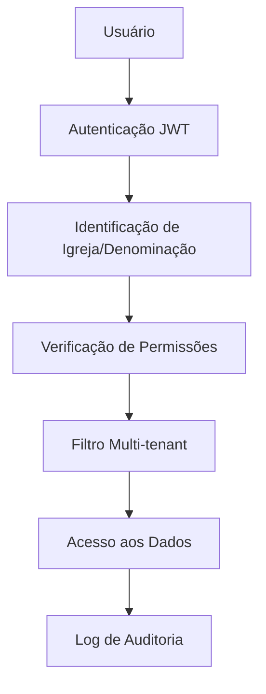

# Sistema de Permissões e Segurança - Obreiro Digital
## Documentação Completa: Teoria, Implementação e Testes Práticos

### Índice
1. [Visão Geral do Sistema](#visão-geral-do-sistema)
2. [Arquitetura de Segurança](#arquitetura-de-segurança)
3. [Hierarquia de Papéis](#hierarquia-de-papéis)
4. [Matriz de Permissões](#matriz-de-permissões)
5. [Segurança de Papéis Restritos](#segurança-de-papéis-restritos)
6. [Implementação Técnica](#implementação-técnica)
7. [Usuários de Teste e Validação Prática](#usuários-de-teste-e-validação-prática)
8. [Cenários de Teste e Validação](#cenários-de-teste-e-validação)
9. [Comandos e Procedures](#comandos-e-procedures)
10. [Auditoria e Monitoramento](#auditoria-e-monitoramento)

---

## Visão Geral do Sistema

O **Obreiro Digital** implementa um sistema hierárquico de permissões baseado em papéis para gestão eclesiástica multi-tenant. O sistema garante:

- **Isolamento total** de dados entre organizações (multi-tenant)
- **Controle granular** de acesso por funcionalidade
- **Hierarquia organizacional** (Denominação → Igreja → Filiais)
- **Segurança rigorosa** para papéis administrativos da plataforma

### Arquitetura Multi-Tenant

```
🏛️ DENOMINAÇÃO (Cliente Premium)
    ↓
⛪ IGREJA (Tenant Principal)
    ↓
🏢 FILIAIS (Unidades Físicas)
    ↓
👥 MEMBROS + VISITANTES + ATIVIDADES
```

**Princípios Fundamentais:**
- **Princípio do Menor Privilégio**: Usuários recebem apenas permissões necessárias
- **Segregação de Responsabilidades**: Cada nível tem responsabilidades específicas
- **Isolamento Multi-tenant**: Dados completamente isolados por organização
- **Hierarquia Ascendente**: Níveis superiores podem acessar níveis inferiores

---

## Arquitetura de Segurança

### Camadas de Proteção

1. **Autenticação**: JWT com validação de integridade
2. **Autorização**: Permissões granulares por papel
3. **Multi-tenancy**: Isolamento automático por organização
4. **Auditoria**: Log completo de ações sensíveis
5. **Validação**: Múltiplas camadas de verificação

### Fluxo de Segurança



---

## Hierarquia de Papéis

### Papéis Restritos (APENAS Plataforma)

#### **SUPER_ADMIN**
- **⚠️ EXCLUSIVO**: Desenvolvedores e donos da plataforma
- **Escopo**: Sistema completo (toda a plataforma SaaS)
- **Acesso**: Irrestrito a todos os dados e funcionalidades
- **Criação**: **APENAS via comando Django** pelos desenvolvedores
- **Uso**: Manutenção técnica, desenvolvimento, configurações globais

#### **PLATFORM_ADMIN**
- **⚠️ EXCLUSIVO**: Equipe administrativa da plataforma
- **Escopo**: Gestão comercial da plataforma SaaS
- **Acesso**: Dashboard de faturamento, estatísticas globais, gestão de clientes
- **Criação**: **APENAS via comando Django** pelos desenvolvedores
- **Uso**: Gestão comercial, suporte técnico, criação de denominações

### Papéis Disponíveis para Clientes

#### **DENOMINATION_ADMIN**
- **Escopo**: Todas as igrejas de uma denominação específica
- **Descrição**: Maior nível administrativo disponível para clientes
- **Permissões Específicas**:
  - ✅ Criar e gerenciar igrejas da denominação
  - ✅ Definir administradores de igreja
  - ✅ Dashboard consolidado de toda a denominação
  - ✅ Relatórios financeiros consolidados
  - ✅ Configurações organizacionais da denominação

#### **CHURCH_ADMIN**
- **Escopo**: Igreja específica e todas as suas filiais
- **Descrição**: Administrador completo de uma igreja
- **Permissões Específicas**:
  - ✅ Gerenciar membros e visitantes da igreja
  - ✅ Criar e administrar filiais
  - ✅ Definir responsáveis por filiais
  - ✅ Configurar atividades e ministérios
  - ✅ Relatórios da igreja e filiais

#### **PASTOR**
- **Escopo**: Igreja específica (acesso pastoral)
- **Descrição**: Pastor com acesso limitado de gestão
- **Permissões Específicas**:
  - ✅ Visualizar dados da igreja
  - ✅ Gerenciar membros e visitantes
  - ✅ Visualizar estatísticas básicas
  - ✅ Navegar hierarquia (apenas visualização)

#### **SECRETARY**
- **Escopo**: Igreja específica (acesso administrativo)
- **Descrição**: Secretário com permissões operacionais
- **Permissões Específicas**:
  - ✅ Gerenciar membros e visitantes
  - ✅ Visualizar relatórios básicos
  - ✅ Atualizar dados da igreja

#### **LEADER**
- **Escopo**: Atividades e ministérios específicos
- **Descrição**: Líder de ministério ou atividade
- **Permissões Específicas**:
  - ✅ Gerenciar atividades e eventos
  - ✅ Visualizar membros
  - ✅ Registrar visitantes

#### **MEMBER**
- **Escopo**: Dados básicos da igreja
- **Descrição**: Membro comum com acesso limitado
- **Permissões Específicas**:
  - ✅ Visualizar informações básicas da igreja
  - ✅ Acessar calendário de atividades
  - ✅ Atualizar dados pessoais

---

## Matriz de Permissões

### Permissões por Funcionalidade

| **Funcionalidade** | **DENOMINATION_ADMIN** | **CHURCH_ADMIN** | **PASTOR** | **SECRETARY** | **LEADER** | **MEMBER** |
|-------------------|:---------------------:|:---------------:|:----------:|:-------------:|:----------:|:----------:|
| **Dashboard Denominação** | ✅ Completo | ❌ Negado | ❌ Negado | ❌ Negado | ❌ Negado | ❌ Negado |
| **Criar Igrejas** | ✅ Sim | ❌ Não | ❌ Não | ❌ Não | ❌ Não | ❌ Não |
| **Gerenciar Igrejas** | ✅ Todas | ✅ Própria | ❌ Não | ❌ Não | ❌ Não | ❌ Não |
| **Criar Filiais** | ✅ Todas | ✅ Própria | ❌ Não | ❌ Não | ❌ Não | ❌ Não |
| **Gerenciar Filiais** | ✅ Todas | ✅ Própria | ❌ Não | ❌ Não | ❌ Não | ❌ Não |
| **Gerenciar Membros** | ✅ Todos | ✅ Igreja | ✅ Igreja | ✅ Igreja | 👁️ Visualizar | 👁️ Lista |
| **Gerenciar Visitantes** | ✅ Todos | ✅ Igreja | ✅ Igreja | ✅ Igreja | ✅ Registrar | ❌ Não |
| **Gerenciar Atividades** | ✅ Todas | ✅ Igreja | ✅ Igreja | ✅ Igreja | ✅ Próprias | 👁️ Visualizar |
| **Relatórios Financeiros** | ✅ Consolidados | ✅ Igreja | 👁️ Básicos | ❌ Não | ❌ Não | ❌ Não |
| **Configurações Igreja** | ✅ Todas | ✅ Própria | ❌ Não | ❌ Não | ❌ Não | ❌ Não |
| **Gestão de Usuários** | ✅ Admins Igreja | ✅ Usuários Igreja | ❌ Não | ❌ Não | ❌ Não | ❌ Não |

**Legenda:** ✅ Acesso Total | 👁️ Somente Leitura | ❌ Sem Acesso

### Critério de Exibição da Sidebar "GESTÃO HIERÁRQUICA"

```typescript
// Condição para mostrar a seção hierárquica no menu
permissions.canManageDenomination || permissions.canCreateChurches
```

**Resultado por Perfil:**
- **DENOMINATION_ADMIN**: ✅ Vê sidebar hierárquica
- **Todos os outros**: ❌ Não veem sidebar hierárquica

---

## Segurança de Papéis Restritos

### ⚠️ AVISO CRÍTICO DE SEGURANÇA

Os papéis **SUPER_ADMIN** e **PLATFORM_ADMIN** são **EXCLUSIVOS** para os **donos e desenvolvedores da plataforma**. Estes papéis **JAMAIS** devem ser atribuídos a clientes ou usuários finais.

### Medidas de Segurança Implementadas

#### **1. Validação no Backend (Django)**

```python
# Serializer - Validação de papel
def validate_role(self, value):
    """Validar que SUPER_ADMIN não pode ser atribuído via cadastro"""
    if value == RoleChoices.SUPER_ADMIN:
        raise serializers.ValidationError(
            "O papel de Super Administrador não pode ser atribuído via cadastro. "
            "Este papel é reservado apenas para desenvolvedores da plataforma."
        )
    return value

# Views - Permissões restritivas
def get_permissions(self):
    if self.action == 'create':
        # APENAS PLATFORM ADMINS podem criar denominações
        permission_classes = [IsPlatformAdmin]
    elif self.action == 'platform_stats':
        permission_classes = [IsPlatformAdmin]
    return [permission() for permission in permission_classes]
```

#### **2. Endpoints Protegidos**

```python
# Endpoints exclusivos da plataforma
POST /api/v1/denominations/           # APENAS IsPlatformAdmin
GET /api/v1/denominations/platform_stats/  # APENAS IsPlatformAdmin
```

#### **3. Validação no Frontend (React + TypeScript)**

```typescript
// Papéis removidos do mapeamento para clientes
const ROLE_PERMISSIONS = {
  // SUPER_ADMIN: Removido - apenas para desenvolvedores
  DENOMINATION_ADMIN: { 
    canManageDenomination: true,
    canCreateChurches: true,
    // ... outras permissões
  },
  // ... outros papéis de cliente
}

// Menu condicional
...(permissions.canManageDenomination || permissions.canCreateChurches ? [
  /* menu hierárquico apenas para Denomination Admins */
] : [])
```

---

## Implementação Técnica

### Classes de Permissão REST

```python
# apps/core/permissions.py

class IsPlatformAdmin(BasePermission):
    """Permite acesso a administradores da plataforma SaaS."""
    def has_permission(self, request, view):
        return request.user.is_superuser or request.user.church_users.filter(
            role=RoleChoices.SUPER_ADMIN
        ).exists()

class IsDenominationAdmin(BasePermission):
    """Permite acesso a administradores de denominação."""
    def has_permission(self, request, view):
        return request.user.church_users.filter(
            role=RoleChoices.DENOMINATION_ADMIN
        ).exists()

class IsChurchAdmin(BasePermission):
    """Permite acesso a administradores de igreja específica."""
    def has_permission(self, request, view):
        return request.user.church_users.filter(
            role__in=[RoleChoices.CHURCH_ADMIN, RoleChoices.DENOMINATION_ADMIN]
        ).exists()

class CanManageDenomination(BasePermission):
    """Verifica se pode gerenciar configurações da denominação"""
    def has_permission(self, request, view):
        return request.user.church_users.filter(
            can_manage_denomination=True
        ).exists()

class CanCreateChurches(BasePermission):
    """Verifica se pode criar igrejas na denominação"""
    def has_permission(self, request, view):
        return request.user.church_users.filter(
            can_create_churches=True
        ).exists()
```

### Middleware Multi-Tenant

```python
class TenantMiddleware:
    """Isolamento automático de dados por igreja"""
    def __init__(self, get_response):
        self.get_response = get_response

    def __call__(self, request):
        if request.user.is_authenticated:
            try:
                church_user = ChurchUser.objects.select_related('church', 'branch').get(
                    user=request.user
                )
                request.church = church_user.church
                request.branch = church_user.branch
                request.user_permissions = church_user.get_all_permissions()
            except ChurchUser.DoesNotExist:
                request.church = None
        
        response = self.get_response(request)
        return response
```

---

## Usuários de Teste e Validação Prática

### Estrutura Organizacional de Teste

#### Denominação
- **Nome:** Denominação Teste - Desenvolvimento
- **Nome Curto:** Teste Dev
- **Administrador:** Admin Denominação
- **Email:** denominacao@teste.com
- **Telefone:** (11) 90000-0000

#### Igrejas

**Igreja Sede**
- **Nome:** Igreja Teste Sede - Desenvolvimento
- **Nome Curto:** Teste Sede
- **Email:** igrejasede@teste.com
- **Telefone:** (11) 90001-0001
- **Plano:** Professional

**Igreja Filha**
- **Nome:** Igreja Teste Filha - Desenvolvimento
- **Nome Curto:** Teste Filha
- **Email:** igrejafilha@teste.com
- **Telefone:** (11) 90002-0002
- **Plano:** Professional

#### Filiais

| **Nome** | **Igreja** | **Email** | **QR Code** |
|----------|------------|-----------|-------------|
| Sede Principal | Igreja Sede | sedeprincipal@teste.com | ✅ Ativo |
| Filial Norte | Igreja Sede | filialnorte@teste.com | ✅ Ativo |
| Filial Sul | Igreja Sede | filialsul@teste.com | ✅ Ativo |

### 8 Usuários de Teste com Todos os Papéis

#### 1. **Administrador de Denominação**
- **Email:** `denominacao.admin@teste.com`
- **Nome:** Admin Denominação
- **Telefone:** (11) 91111-1111
- **Papel:** `DENOMINATION_ADMIN`
- **Igreja:** Igreja Sede
- **Descrição:** Administrador da denominação - pode gerenciar todas as igrejas

**Permissões:**
- ✅ Acesso administrativo
- ✅ Gerenciar membros
- ✅ Gerenciar visitantes
- ✅ Gerenciar atividades
- ✅ Ver relatórios
- ✅ Gerenciar filiais

#### 2. **Administrador da Igreja Sede**
- **Email:** `igreja.admin@teste.com`
- **Nome:** Admin Igreja Sede
- **Telefone:** (11) 92222-2222
- **Papel:** `CHURCH_ADMIN`
- **Igreja:** Igreja Sede
- **Descrição:** Administrador da igreja sede

**Permissões:**
- ✅ Acesso administrativo
- ✅ Gerenciar membros
- ✅ Gerenciar visitantes
- ✅ Gerenciar atividades
- ✅ Ver relatórios
- ✅ Gerenciar filiais

#### 3. **Administrador da Igreja Filha**
- **Email:** `igreja.filha.admin@teste.com`
- **Nome:** Admin Igreja Filha
- **Telefone:** (11) 92223-2223
- **Papel:** `CHURCH_ADMIN`
- **Igreja:** Igreja Filha
- **Descrição:** Administrador da igreja filha

**Permissões:**
- ✅ Acesso administrativo
- ✅ Gerenciar membros
- ✅ Gerenciar visitantes
- ✅ Gerenciar atividades
- ✅ Ver relatórios
- ✅ Gerenciar filiais

#### 4. **Pastor Principal**
- **Email:** `pastor@teste.com`
- **Nome:** Pastor Principal
- **Telefone:** (11) 93333-3333
- **Papel:** `PASTOR`
- **Igreja:** Igreja Sede
- **Descrição:** Pastor da igreja

**Permissões:**
- ✅ Acesso administrativo
- ✅ Gerenciar membros
- ✅ Gerenciar visitantes
- ✅ Gerenciar atividades
- ✅ Ver relatórios
- ❌ Gerenciar filiais (não por padrão)

#### 5. **Secretário da Igreja**
- **Email:** `secretario@teste.com`
- **Nome:** Secretário Igreja
- **Telefone:** (11) 94444-4444
- **Papel:** `SECRETARY`
- **Igreja:** Igreja Sede
- **Descrição:** Secretário da igreja

**Permissões:**
- ✅ Acesso administrativo
- ✅ Gerenciar membros
- ✅ Gerenciar visitantes
- ❌ Gerenciar atividades
- ✅ Ver relatórios
- ❌ Gerenciar filiais

#### 6. **Líder de Filial**
- **Email:** `lider@teste.com`
- **Nome:** Líder Filial Norte
- **Telefone:** (11) 95555-5555
- **Papel:** `LEADER`
- **Igreja:** Igreja Sede
- **Filiais Gerenciadas:** Apenas Filial Norte
- **Descrição:** Líder responsável pela filial norte

**Permissões:**
- ❌ Acesso administrativo
- ❌ Gerenciar membros
- ✅ Gerenciar visitantes
- ✅ Gerenciar atividades
- ❌ Ver relatórios
- ❌ Gerenciar filiais (exceto Filial Norte)

#### 7. **Membro Comum**
- **Email:** `membro@teste.com`
- **Nome:** Membro Comum
- **Telefone:** (11) 96666-6666
- **Papel:** `MEMBER`
- **Igreja:** Igreja Sede
- **Descrição:** Membro comum da igreja

**Permissões:**
- ❌ Acesso administrativo
- ❌ Gerenciar membros
- ❌ Gerenciar visitantes
- ❌ Gerenciar atividades
- ❌ Ver relatórios
- ❌ Gerenciar filiais

#### 8. **Usuário Somente Leitura**
- **Email:** `readonly@teste.com`
- **Nome:** Usuário Somente Leitura
- **Telefone:** (11) 97777-7777
- **Papel:** `READ_ONLY`
- **Igreja:** Igreja Sede
- **Descrição:** Usuário com acesso somente leitura

**Permissões:**
- ❌ Acesso administrativo
- ❌ Gerenciar membros
- ❌ Gerenciar visitantes
- ❌ Gerenciar atividades
- ❌ Ver relatórios
- ❌ Gerenciar filiais

### Credenciais Padrão
- **Senha para todos os usuários:** `teste123`
- **Formato de login:** Email + senha
- **Perfis:** Todos têm perfis completos com dados pessoais

---

## Cenários de Teste e Validação

### Casos de Teste por Funcionalidade

#### 1. **Hierarquia de Denominação**
- **Usuário:** `denominacao.admin@teste.com`
- **Testa:** Gestão de múltiplas igrejas
- **Permissões:** Todas as permissões em todas as igrejas da denominação

#### 2. **Administração de Igreja**
- **Usuários:** `igreja.admin@teste.com`, `igreja.filha.admin@teste.com`
- **Testa:** Gestão completa de uma igreja específica
- **Permissões:** Todas as permissões dentro de sua igreja

#### 3. **Liderança Pastoral**
- **Usuário:** `pastor@teste.com`
- **Testa:** Permissões pastorais (sem gestão de filiais)
- **Permissões:** Administrativas, exceto gestão de filiais

#### 4. **Secretariado**
- **Usuário:** `secretario@teste.com`
- **Testa:** Gestão de dados básicos (sem atividades)
- **Permissões:** Membros, visitantes e relatórios

#### 5. **Liderança de Filial**
- **Usuário:** `lider@teste.com`
- **Testa:** Gestão restrita a filiais específicas
- **Permissões:** Apenas visitantes e atividades da Filial Norte

#### 6. **Membro Comum**
- **Usuário:** `membro@teste.com`
- **Testa:** Acesso básico de membro
- **Permissões:** Apenas visualização de dados gerais

#### 7. **Acesso Restrito**
- **Usuário:** `readonly@teste.com`
- **Testa:** Acesso somente leitura
- **Permissões:** Mínimas, apenas leitura

#### 8. **Isolamento entre Igrejas**
- **Comparar:** `igreja.admin@teste.com` vs `igreja.filha.admin@teste.com`
- **Testa:** Cada admin só acessa sua própria igreja
- **Validação:** Isolamento multi-tenant

### Cenários de Teste Recomendados

#### **Teste de Hierarquia**
```
1. Login como denominacao.admin@teste.com
2. Verificar acesso a ambas as igrejas
3. Login como igreja.admin@teste.com  
4. Verificar acesso apenas à Igreja Sede
```

#### **Teste de Filiais**
```
1. Login como igreja.admin@teste.com
2. Verificar acesso a todas as 3 filiais
3. Login como lider@teste.com
4. Verificar acesso apenas à Filial Norte
```

#### **Teste de Permissões**
```
1. Login como pastor@teste.com
2. Tentar gerenciar membros (deve funcionar)
3. Tentar gerenciar filiais (deve falhar)
4. Login como membro@teste.com
5. Tentar qualquer ação administrativa (deve falhar)
```

#### **Teste de Isolamento**
```
1. Login como igreja.admin@teste.com
2. Verificar que só vê dados da Igreja Sede
3. Login como igreja.filha.admin@teste.com
4. Verificar que só vê dados da Igreja Filha
```

---

## Comandos e Procedures

### Criação de Papéis Restritos

#### **Super Admin (Desenvolvimento)**
```bash
# APENAS para desenvolvedores da plataforma
python manage.py shell
from django.contrib.auth import get_user_model
from apps.core.models import RoleChoices

User = get_user_model()
user = User.objects.create_superuser('admin@plataforma.com', 'senha_segura')
```

#### **Platform Admin (Produção)**
```bash
# APENAS para equipe da plataforma
python manage.py create_platform_admin \
  --email admin@obreirovirtual.com \
  --name "Admin Principal" \
  --phone "(11) 99999-9999"
```

### Gerenciamento de Usuários de Teste

#### Criar usuários de teste
```bash
# Criar todos os usuários com senha padrão
python manage.py create_test_users

# Criar com senha personalizada
python manage.py create_test_users --password "minhasenha123"

# Limpar usuários existentes e criar novos
python manage.py create_test_users --clean

# Ver ajuda do comando
python manage.py help create_test_users
```

#### Limpar ambiente de teste
```bash
# Remove todos os usuários de teste
python manage.py create_test_users --clean
```

### Endpoints para Validação

#### Autenticação
```bash
# Teste de login com curl
curl -X POST http://localhost:8000/api/v1/auth/login/ \
  -H "Content-Type: application/json" \
  -d '{
    "email": "denominacao.admin@teste.com",
    "password": "teste123"
  }'
```

#### Gestão de Usuários
- `GET /api/v1/users/me/` - Dados do usuário atual
- `GET /api/v1/users/` - Listar usuários
- `GET /api/v1/church-users/` - Usuários da igreja

#### Gestão de Igreja
- `GET /api/v1/churches/` - Listar igrejas
- `GET /api/v1/branches/` - Listar filiais

#### Gestão de Membros
- `GET /api/v1/members/` - Listar membros
- `POST /api/v1/members/` - Criar membro

#### Gestão de Visitantes
- `GET /api/v1/visitors/` - Listar visitantes
- `POST /api/v1/visitors/` - Criar visitante

### Testes de Validação de Segurança

```bash
# Teste 1: Denomination Admin acessando sidebar
curl -H "Authorization: Bearer <denomination_admin_token>" \
     "http://localhost:8000/api/v1/user/permissions/"
# Esperado: canManageDenomination=true

# Teste 2: Church Admin tentando criar igreja
curl -X POST -H "Authorization: Bearer <church_admin_token>" \
     "http://localhost:8000/api/v1/denominations/1/churches/"
# Esperado: 403 Forbidden

# Teste 3: Platform Admin criando denominação
curl -X POST -H "Authorization: Bearer <platform_admin_token>" \
     "http://localhost:8000/api/v1/denominations/"
# Esperado: 201 Created
```

### Comandos de Monitoramento

```bash
# Verificar permissões de usuário
docker-compose -f docker-compose.dev.yml exec backend python manage.py shell -c "
from apps.accounts.models import CustomUser
user = CustomUser.objects.get(email='denominacao.admin@teste.com')
print(f'Can manage denomination: {user.church_users.first().can_manage_denomination}')
print(f'Role: {user.church_users.first().role}')
"

# Verificar estrutura de denominações
docker-compose -f docker-compose.dev.yml exec backend python manage.py shell -c "
from apps.denominations.models import Denomination
print(f'Total denominações: {Denomination.objects.count()}')
for d in Denomination.objects.all():
    print(f'- {d.name}: {d.churches.count()} igrejas')
"

# Verificar logs de segurança
docker-compose -f docker-compose.dev.yml exec backend python manage.py shell -c "
from apps.core.models import AdminActionLog
recent_actions = AdminActionLog.objects.filter(
    action__in=['create_church', 'assign_admin', 'promote_user']
).order_by('-created_at')[:10]
for action in recent_actions:
    print(f'{action.created_at}: {action.user.email} - {action.action}')
"
```

---

## Auditoria e Monitoramento

### Logs de Segurança

```python
class AdminActionLog(BaseModel):
    """Log de ações administrativas para auditoria"""
    user = models.ForeignKey(settings.AUTH_USER_MODEL, on_delete=models.CASCADE)
    action = models.CharField(max_length=50)  # create_church, assign_admin, etc.
    target_object_type = models.CharField(max_length=50)
    target_object_id = models.PositiveIntegerField()
    details = models.JSONField(default=dict)
    ip_address = models.GenericIPAddressField()
    user_agent = models.TextField()
    
    class Meta:
        ordering = ['-created_at']
        indexes = [
            models.Index(fields=['user', '-created_at']),
            models.Index(fields=['action', '-created_at']),
        ]
```

### Métricas de Segurança

- **Tentativas de acesso não autorizado** por endpoint
- **Mudanças de papel** e permissões
- **Criação de novos administradores** e denominações
- **Acessos a funcionalidades restritas** por tempo
- **Padrões suspeitos** de uso da API

### Checklist de Segurança

#### **Para Desenvolvedores**
- [ ] SUPER_ADMIN criado apenas via comando
- [ ] Platform endpoints protegidos com IsPlatformAdmin
- [ ] Validação de papéis no serializer
- [ ] Testes de segurança implementados
- [ ] Logs de auditoria funcionando

#### **Para Administradores da Plataforma**
- [ ] Monitoramento de tentativas de acesso indevido
- [ ] Alertas configurados para atividades suspeitas
- [ ] Backup regular das configurações de segurança
- [ ] Revisão periódica de permissões

#### **Para Suporte ao Cliente**
- [ ] Treinamento sobre limitações de papéis
- [ ] Scripts para explicar hierarquia de permissões
- [ ] Alternativas para atender necessidades dos clientes
- [ ] Escalação para casos de tentativa de bypass

### Checklist de Testes

#### Funcionalidades Básicas
- [ ] Login com cada tipo de usuário
- [ ] Verificar dados retornados na API `/users/me/`
- [ ] Testar logout

#### Permissões por Papel
- [ ] Denomination Admin: acesso a todas as igrejas
- [ ] Church Admin: acesso apenas à sua igreja
- [ ] Pastor: permissões administrativas sem filiais
- [ ] Secretary: gestão de membros/visitantes
- [ ] Leader: apenas sua filial designada
- [ ] Member: apenas visualização
- [ ] Read Only: acesso mínimo

#### Isolamento Multi-Tenant
- [ ] Igreja Sede vs Igreja Filha (isolamento completo)
- [ ] Filiais: acesso correto por usuário
- [ ] Dados não vazam entre igrejas

#### Endpoints Protegidos
- [ ] Criar/editar membros (apenas admins)
- [ ] Gerenciar filiais (apenas admins com permissão)
- [ ] Ver relatórios (conforme permissão)
- [ ] Ações administrativas bloqueadas para membros

#### Casos Extremos
- [ ] Usuário sem igreja (não deve acontecer)
- [ ] Usuário inativo
- [ ] Permissões conflitantes
- [ ] Acesso a recursos inexistentes

---

## Avisos Importantes

### Segurança
- ✅ **Apenas para desenvolvimento/teste**
- ❌ **NUNCA usar em produção**
- 🔒 **Senhas são simples para facilitar testes**

### Alertas de Segurança

#### **Cenários de Risco**
1. **Cliente solicitando papel SUPER_ADMIN**
   - ❌ **NUNCA** conceder
   - ✅ Explicar que é exclusivo da plataforma
   - ✅ Oferecer DENOMINATION_ADMIN como alternativa

2. **Tentativa de bypass de validações**
   - ❌ Investigar imediatamente
   - ✅ Revisar logs de segurança
   - ✅ Reforçar validações se necessário

3. **Acesso não autorizado a endpoints restritos**
   - ❌ Bloquear acesso imediatamente
   - ✅ Analisar origem do acesso
   - ✅ Implementar medidas adicionais

### Limpeza
- Use `--clean` para remover dados de teste
- Dados são criados com prefixo "Teste" para identificação
- Comando é seguro e só remove dados de teste

### Manutenção
- Recrie os usuários após mudanças no sistema de permissões
- Verifique se as permissões estão corretas após atualizações
- Use para validar novos recursos antes do deploy

---

## Resumo e Considerações Finais

### Sistema de Segurança Implementado

1. **Hierarquia clara de papéis** com responsabilidades bem definidas
2. **Papéis restritos protegidos** (SUPER_ADMIN, PLATFORM_ADMIN)
3. **Permissões granulares** por funcionalidade
4. **Multi-tenancy robusto** com isolamento total de dados
5. **Validações em múltiplas camadas** (backend, frontend, banco)
6. **Auditoria completa** de ações administrativas
7. **Monitoramento ativo** de segurança
8. **Usuários de teste abrangentes** para validação completa

### Pontos de Atenção

- **Gestão hierárquica** é recurso **premium exclusivo** para Denomination Admins
- **SUPER_ADMIN e PLATFORM_ADMIN** são **exclusivos da plataforma**
- **Validações impedem** atribuição indevida de papéis restritos
- **Logs de auditoria** rastreiam todas as ações sensíveis
- **Sistema escalável** para milhares de organizações
- **Usuários de teste** cobrem todos os cenários de uso

### Evolução Futura

- **v1.1**: Permissões granulares por funcionalidade específica
- **v2.0**: Sistema de permissões baseado em recursos dinâmicos
- **v3.0**: Permissões temporárias e delegação de autoridade

**O sistema está pronto para produção com máxima segurança e flexibilidade organizacional, validado através de usuários de teste abrangentes.**

---

**Documento criado em:** 16 de Agosto de 2025  
**Versão:** 2.0 Consolidada - Teoria + Prática  
**Classificação:** Confidencial - Equipe da Plataforma  
**Próxima revisão:** Pós-auditoria de segurança e testes práticos