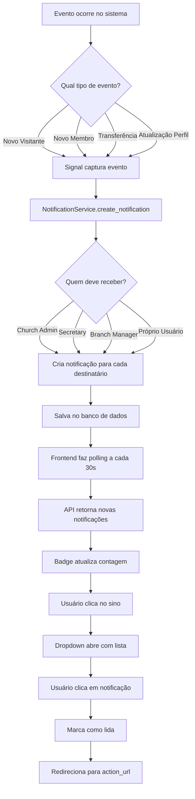

# 📋 PLANO DE IMPLEMENTAÇÃO - SISTEMA DE NOTIFICAÇÕES

## 🎯 ANÁLISE DA SITUAÇÃO ATUAL

### ✅ O que já existe:
1. **Frontend**:
   - Ícone de sino no Header com badge vermelho (hardcoded)
   - Item "Notificações" no dropdown do usuário
   - Sistema de Toast (Sonner) funcionando
   - Componentes Alert/AlertDialog prontos
   - Tipo `HierarchyNotification` já definido

2. **Backend**:
   - Signals implementados para visitantes (registro e conversão)
   - Sistema de envio de e-mails funcionando
   - UserProfile com campos `email_notifications` e `sms_notifications`
   - Sistema multi-tenant com isolamento por igreja

### ❌ O que NÃO existe:
1. Model de Notificação no backend
2. API endpoints para notificações
3. Componente de lista de notificações no frontend
4. Sistema de marcação de lida/não lida
5. Atualização em tempo real (WebSocket/Polling)
6. Signals para membros e outras entidades

---

## 📐 ARQUITETURA PROPOSTA

### 🎨 Abordagem: **Simples e Funcional** (Polling)
- Não usar WebSocket inicialmente (complexidade)
- Usar **polling** (requisições periódicas)
- Armazenar notificações em banco de dados
- Badge com contagem de não lidas
- Dropdown com lista de notificações

---

## 🏗️ ESTRUTURA DE IMPLEMENTAÇÃO

### **FASE 1: Backend - Models e API** (Prioridade ALTA)

#### 1.1. Criar app de notificações
```
backend/apps/notifications/
├── __init__.py
├── models.py          # Model Notification
├── admin.py           # Admin Django
├── serializers.py     # DRF Serializers
├── views.py           # ViewSets
├── urls.py            # URLs
├── signals.py         # Signals automáticos
├── services.py        # Lógica de criação de notificações
└── migrations/
```

#### 1.2. Model `Notification`
```python
class NotificationTypeChoices:
    # Visitantes
    NEW_VISITOR = 'new_visitor'
    VISITOR_CONVERTED = 'visitor_converted'
    
    # Membros
    NEW_MEMBER = 'new_member'
    MEMBER_TRANSFERRED = 'member_transferred'
    MEMBER_STATUS_CHANGED = 'member_status_changed'
    
    # Usuário
    PROFILE_UPDATED = 'profile_updated'
    AVATAR_UPDATED = 'avatar_updated'
    PASSWORD_CHANGED = 'password_changed'
    
    # Sistema
    SYSTEM_ALERT = 'system_alert'

class Notification(BaseModel):
    # Destinatário
    user = FK(CustomUser)
    
    # Isolamento multi-tenant
    church = FK(Church)
    
    # Tipo e conteúdo
    notification_type = CharField(choices=...)
    title = CharField(max_length=200)
    message = TextField(max_length=500)
    
    # Status
    is_read = BooleanField(default=False)
    read_at = DateTimeField(null=True, blank=True)
    
    # Metadados (JSON)
    metadata = JSONField(default=dict)
    # Exemplo: {'member_id': 123, 'visitor_id': 45}
    
    # Link de ação
    action_url = CharField(max_length=500, null=True)
    
    # Prioridade
    priority = CharField(
        choices=['low', 'medium', 'high', 'critical'],
        default='medium'
    )
```

#### 1.3. Endpoints da API
```
GET    /api/v1/notifications/                  # Listar (paginado)
GET    /api/v1/notifications/unread_count/     # Contagem não lidas
POST   /api/v1/notifications/{id}/mark_read/   # Marcar como lida
POST   /api/v1/notifications/mark_all_read/    # Marcar todas como lidas
DELETE /api/v1/notifications/{id}/             # Deletar notificação
POST   /api/v1/notifications/clear_all/        # Limpar todas
```

#### 1.4. Service Layer
```python
class NotificationService:
    @staticmethod
    def create_notification(
        user, 
        church, 
        notification_type, 
        title, 
        message, 
        metadata=None,
        action_url=None,
        priority='medium'
    ):
        """Cria notificação com validações"""
        
    @staticmethod
    def notify_church_admins(church, notification_type, ...):
        """Notifica todos admins de uma igreja"""
        
    @staticmethod
    def notify_branch_managers(branch, notification_type, ...):
        """Notifica gestores de uma filial"""
```

---

### **FASE 2: Backend - Signals Automáticos** (Prioridade ALTA)

#### 2.1. Signals para Visitantes (já existem parcialmente)
```python
# apps/visitors/signals.py

@receiver(post_save, sender=Visitor)
def create_visitor_notification(sender, instance, created, **kwargs):
    if created and instance.registration_source == 'qr_code':
        # Notificar admins da igreja
        NotificationService.notify_church_admins(
            church=instance.church,
            notification_type='new_visitor',
            title=f'Novo visitante: {instance.full_name}',
            message=f'{instance.full_name} visitou {instance.branch.name}',
            metadata={'visitor_id': instance.id},
            action_url=f'/visitantes/{instance.id}'
        )

@receiver(post_save, sender=Visitor)
def visitor_converted_notification(sender, instance, **kwargs):
    if instance.converted_to_member and instance.conversion_date:
        # Verificar se é recente
        # Notificar admins
```

#### 2.2. Signals para Membros (NOVO)
```python
# apps/members/signals.py

@receiver(post_save, sender=Member)
def create_member_notification(sender, instance, created, **kwargs):
    if created:
        NotificationService.notify_church_admins(...)

@receiver(post_save, sender=Member)
def member_transferred_notification(sender, instance, **kwargs):
    # Detectar mudança de branch
    if instance.tracker.has_changed('branch'):
        NotificationService.notify_branch_managers(...)

@receiver(post_save, sender=Member)
def member_status_changed_notification(sender, instance, **kwargs):
    if instance.tracker.has_changed('membership_status'):
        NotificationService.notify_church_admins(...)
```

#### 2.3. Signals para UserProfile (NOVO)
```python
# apps/accounts/signals.py

@receiver(post_save, sender=UserProfile)
def profile_updated_notification(sender, instance, **kwargs):
    # Notificar o próprio usuário
    if not kwargs.get('created'):
        NotificationService.create_notification(
            user=instance.user,
            church=instance.user.primary_church,  # ou active church
            notification_type='profile_updated',
            title='Perfil atualizado',
            message='Suas informações pessoais foram atualizadas',
            action_url='/perfil'
        )

@receiver(post_save, sender=UserProfile)
def avatar_updated_notification(sender, instance, **kwargs):
    if instance.tracker.has_changed('avatar'):
        # Notificar usuário
```

---

### **FASE 3: Frontend - Componentes** (Prioridade ALTA)

#### 3.1. Tipos TypeScript
```typescript
// frontend/src/types/notifications.ts

export interface Notification {
  id: number;
  user: number;
  church: number;
  notification_type: NotificationType;
  title: string;
  message: string;
  is_read: boolean;
  read_at: string | null;
  metadata: Record<string, any>;
  action_url: string | null;
  priority: 'low' | 'medium' | 'high' | 'critical';
  created_at: string;
}

export type NotificationType = 
  | 'new_visitor'
  | 'visitor_converted'
  | 'new_member'
  | 'member_transferred'
  | 'member_status_changed'
  | 'profile_updated'
  | 'avatar_updated'
  | 'password_changed'
  | 'system_alert';

export interface NotificationIconConfig {
  icon: LucideIcon;
  color: string;
  bgColor: string;
}
```

#### 3.2. Service
```typescript
// frontend/src/services/notificationService.ts

class NotificationService {
  async getNotifications(params?: {
    is_read?: boolean;
    page?: number;
    page_size?: number;
  }): Promise<PaginatedResponse<Notification>> { }
  
  async getUnreadCount(): Promise<{ count: number }> { }
  
  async markAsRead(id: number): Promise<Notification> { }
  
  async markAllAsRead(): Promise<{ message: string }> { }
  
  async deleteNotification(id: number): Promise<void> { }
  
  async clearAll(): Promise<{ message: string }> { }
}

export const notificationService = new NotificationService();
```

#### 3.3. Hook
```typescript
// frontend/src/hooks/useNotifications.ts

export function useNotifications() {
  const [notifications, setNotifications] = useState<Notification[]>([]);
  const [unreadCount, setUnreadCount] = useState(0);
  const [loading, setLoading] = useState(false);
  
  // Polling a cada 30 segundos
  useEffect(() => {
    fetchUnreadCount();
    const interval = setInterval(fetchUnreadCount, 30000);
    return () => clearInterval(interval);
  }, []);
  
  const fetchNotifications = async () => { };
  const fetchUnreadCount = async () => { };
  const markAsRead = async (id: number) => { };
  const markAllAsRead = async () => { };
  
  return {
    notifications,
    unreadCount,
    loading,
    fetchNotifications,
    markAsRead,
    markAllAsRead
  };
}
```

#### 3.4. Componente NotificationDropdown
```typescript
// frontend/src/components/layout/NotificationDropdown.tsx

export const NotificationDropdown: React.FC = () => {
  const { notifications, unreadCount, markAsRead } = useNotifications();
  
  return (
    <DropdownMenu>
      <DropdownMenuTrigger asChild>
        <Button variant="ghost" size="icon" className="relative">
          <Bell className="h-5 w-5" />
          {unreadCount > 0 && (
            <span className="absolute top-0 right-0 h-5 w-5 bg-red-500 
                           text-white text-xs rounded-full flex items-center 
                           justify-center">
              {unreadCount > 9 ? '9+' : unreadCount}
            </span>
          )}
        </Button>
      </DropdownMenuTrigger>
      
      <DropdownMenuContent align="end" className="w-80">
        <div className="flex items-center justify-between p-2 border-b">
          <h3 className="font-semibold">Notificações</h3>
          {unreadCount > 0 && (
            <Button variant="ghost" size="sm" onClick={markAllAsRead}>
              Marcar todas como lidas
            </Button>
          )}
        </div>
        
        <ScrollArea className="h-96">
          {notifications.length === 0 ? (
            <div className="p-4 text-center text-muted-foreground">
              Nenhuma notificação
            </div>
          ) : (
            notifications.map(notif => (
              <NotificationItem 
                key={notif.id}
                notification={notif}
                onMarkAsRead={markAsRead}
              />
            ))
          )}
        </ScrollArea>
      </DropdownMenuContent>
    </DropdownMenu>
  );
};
```

#### 3.5. Componente NotificationItem
```typescript
export const NotificationItem: React.FC<{
  notification: Notification;
  onMarkAsRead: (id: number) => void;
}> = ({ notification, onMarkAsRead }) => {
  const navigate = useNavigate();
  const iconConfig = getNotificationIcon(notification.notification_type);
  
  const handleClick = () => {
    if (!notification.is_read) {
      onMarkAsRead(notification.id);
    }
    if (notification.action_url) {
      navigate(notification.action_url);
    }
  };
  
  return (
    <div 
      className={cn(
        "p-3 border-b cursor-pointer hover:bg-gray-50",
        !notification.is_read && "bg-blue-50"
      )}
      onClick={handleClick}
    >
      <div className="flex gap-3">
        <div className={cn("p-2 rounded-full", iconConfig.bgColor)}>
          <iconConfig.icon className={cn("h-4 w-4", iconConfig.color)} />
        </div>
        
        <div className="flex-1">
          <div className="flex items-start justify-between">
            <h4 className="font-medium text-sm">{notification.title}</h4>
            {!notification.is_read && (
              <div className="h-2 w-2 bg-blue-500 rounded-full" />
            )}
          </div>
          <p className="text-sm text-muted-foreground mt-1">
            {notification.message}
          </p>
          <p className="text-xs text-muted-foreground mt-1">
            {formatDistanceToNow(new Date(notification.created_at), {
              addSuffix: true,
              locale: ptBR
            })}
          </p>
        </div>
      </div>
    </div>
  );
};
```

#### 3.6. Utility - Ícones por tipo
```typescript
// frontend/src/utils/notificationIcons.ts

const NOTIFICATION_ICONS: Record<NotificationType, NotificationIconConfig> = {
  new_visitor: {
    icon: UserPlus,
    color: 'text-green-600',
    bgColor: 'bg-green-100'
  },
  visitor_converted: {
    icon: CheckCircle,
    color: 'text-blue-600',
    bgColor: 'bg-blue-100'
  },
  new_member: {
    icon: Users,
    color: 'text-purple-600',
    bgColor: 'bg-purple-100'
  },
  member_transferred: {
    icon: ArrowRightLeft,
    color: 'text-orange-600',
    bgColor: 'bg-orange-100'
  },
  member_status_changed: {
    icon: RefreshCw,
    color: 'text-yellow-600',
    bgColor: 'bg-yellow-100'
  },
  profile_updated: {
    icon: User,
    color: 'text-gray-600',
    bgColor: 'bg-gray-100'
  },
  avatar_updated: {
    icon: Camera,
    color: 'text-pink-600',
    bgColor: 'bg-pink-100'
  },
  password_changed: {
    icon: Lock,
    color: 'text-indigo-600',
    bgColor: 'bg-indigo-100'
  },
  system_alert: {
    icon: AlertTriangle,
    color: 'text-red-600',
    bgColor: 'bg-red-100'
  }
};

export function getNotificationIcon(type: NotificationType): NotificationIconConfig {
  return NOTIFICATION_ICONS[type] || NOTIFICATION_ICONS.system_alert;
}
```

---

### **FASE 4: Integração Header** (Prioridade ALTA)

```typescript
// Modificar Header.tsx

import { NotificationDropdown } from './NotificationDropdown';

// Substituir:
<Button variant="ghost" size="icon" className="relative">
  <Bell className="h-5 w-5 text-gray-600" />
  <span className="absolute top-0 right-0 h-2 w-2 bg-red-500 rounded-full"></span>
</Button>

// Por:
<NotificationDropdown />
```

---

## 🎯 EVENTOS DISPARADORES DE NOTIFICAÇÕES

### 📊 Tabela de Eventos vs Destinatários

| Evento | Tipo | Destinatários | Prioridade |
|--------|------|---------------|------------|
| **Novo visitante via QR** | `new_visitor` | Church Admin + Branch Manager + Secretary | Medium |
| **Visitante convertido** | `visitor_converted` | Church Admin + Pastor | High |
| **Novo membro cadastrado** | `new_member` | Church Admin + Secretary | Medium |
| **Membro transferido** | `member_transferred` | Church Admin + Branch Manager (origem e destino) | High |
| **Status de membro alterado** | `member_status_changed` | Church Admin + O próprio membro | Medium |
| **Avatar atualizado** | `avatar_updated` | Próprio usuário | Low |
| **Dados pessoais atualizados** | `profile_updated` | Próprio usuário | Low |
| **Senha alterada** | `password_changed` | Próprio usuário | High |

---

## 📝 REGRAS DE NEGÓCIO

### 1. **Filtragem por Papel**
```python
def get_notification_recipients(event_type, entity, church):
    """
    Retorna lista de usuários que devem receber a notificação
    baseado no tipo de evento e papel
    """
    recipients = []
    
    if event_type in ['new_visitor', 'new_member']:
        # Church Admin + Secretary
        recipients += get_users_by_role(church, ['CHURCH_ADMIN', 'SECRETARY'])
    
    if event_type == 'visitor_converted':
        # Church Admin + Pastor
        recipients += get_users_by_role(church, ['CHURCH_ADMIN', 'PASTOR'])
    
    if event_type == 'member_transferred':
        # Church Admin + Branch Managers
        recipients += get_users_by_role(church, ['CHURCH_ADMIN', 'BRANCH_MANAGER'])
    
    if event_type in ['profile_updated', 'avatar_updated', 'password_changed']:
        # Apenas o próprio usuário
        recipients = [entity.user]
    
    if event_type == 'member_status_changed':
        # Church Admin + o próprio membro (se tiver acesso ao sistema)
        recipients += get_users_by_role(church, ['CHURCH_ADMIN'])
        if hasattr(entity, 'user') and entity.user:
            recipients.append(entity.user)
    
    return list(set(recipients))  # Remove duplicatas
```

### 2. **Isolamento Multi-Tenant**
- Notificações sempre vinculadas a uma igreja
- Usuários só veem notificações da igreja ativa
- Ao trocar de igreja ativa, carregar novas notificações

### 3. **Limpeza Automática**
- Notificações lidas > 30 dias: deletar automaticamente
- Notificações não lidas > 90 dias: arquivar
- Comando Django: `python manage.py cleanup_old_notifications`

### 4. **Preferências do Usuário** (FASE FUTURA)
```python
class NotificationPreference(models.Model):
    user = FK(CustomUser)
    notification_type = CharField(choices=...)
    enabled = BooleanField(default=True)
    email_enabled = BooleanField(default=False)
    sms_enabled = BooleanField(default=False)
```

---

## 🚀 ROADMAP DE IMPLEMENTAÇÃO

### **Sprint 1** (2-3 dias)
- [ ] Criar app `notifications` no backend
- [ ] Implementar Model `Notification`
- [ ] Criar Serializers e ViewSets
- [ ] Implementar endpoints da API
- [ ] Testes básicos dos endpoints

### **Sprint 2** (2 dias)
- [ ] Implementar `NotificationService`
- [ ] Criar signals para visitantes
- [ ] Criar signals para membros
- [ ] Criar signals para UserProfile
- [ ] Testar criação automática de notificações

### **Sprint 3** (2-3 dias)
- [ ] Criar tipos TypeScript
- [ ] Implementar `notificationService`
- [ ] Criar hook `useNotifications`
- [ ] Implementar polling a cada 30s

### **Sprint 4** (2 dias)
- [ ] Criar componente `NotificationDropdown`
- [ ] Criar componente `NotificationItem`
- [ ] Implementar utility `notificationIcons`
- [ ] Integrar no Header
- [ ] Testes de UI

### **Sprint 5** (1 dia)
- [ ] Ajustes de UX
- [ ] Animações (opcional)
- [ ] Sons de notificação (opcional)
- [ ] Testes finais
- [ ] Documentação

---

## 🎨 MELHORIAS FUTURAS (Opcional)

1. **WebSocket** para notificações em tempo real
2. **Push Notifications** (navegador)
3. **Preferências granulares** por tipo de notificação
4. **Centro de notificações** (página dedicada)
5. **Notificações por e-mail** (já parcialmente implementado)
6. **Notificações por SMS** (Twilio)
7. **Agrupamento de notificações** similares
8. **Filtros e busca** no histórico de notificações

---

## ✅ CHECKLIST DE VALIDAÇÃO

Antes de considerar concluído, validar:

- [ ] Notificações aparecem em tempo real (max 30s delay)
- [ ] Badge mostra contagem correta de não lidas
- [ ] Clicar em notificação marca como lida
- [ ] Clicar em notificação redireciona para URL correta
- [ ] "Marcar todas como lidas" funciona
- [ ] Apenas notificações da igreja ativa são mostradas
- [ ] Ícones e cores apropriados por tipo
- [ ] Performance: lista com 100+ notificações
- [ ] Isolamento multi-tenant funcional
- [ ] Signals disparam para todos os eventos listados
- [ ] Notificações são criadas apenas para destinatários corretos (filtro por papel)
- [ ] Notificações antigas são limpas automaticamente

---

## 📌 NOTAS IMPORTANTES

### Dependências do Backend
```python
# requirements.txt (já existentes, não precisa adicionar)
Django>=5.2.3
djangorestframework
django-filter
```

### Dependências do Frontend
```json
// package.json (já existentes, não precisa adicionar)
{
  "lucide-react": "^0.x.x",
  "sonner": "^1.x.x",
  "date-fns": "^2.x.x"
}
```

### Configuração de CORS (Backend)
Garantir que o polling funcione corretamente:
```python
# settings/base.py
CORS_ALLOW_CREDENTIALS = True
CORS_ALLOWED_ORIGINS = [
    "http://localhost:5173",
    "http://localhost:8000",
]
```

### Configuração de Intervalo de Polling (Frontend)
```typescript
// Ajustar conforme necessidade
const POLLING_INTERVAL = 30000; // 30 segundos
```

---

## 🔄 FLUXO COMPLETO DE UMA NOTIFICAÇÃO



---

**Documento criado em:** 7 de novembro de 2025  
**Última atualização:** 7 de novembro de 2025  
**Versão:** 1.0  
**Autor:** Sistema Obreiro Digital
